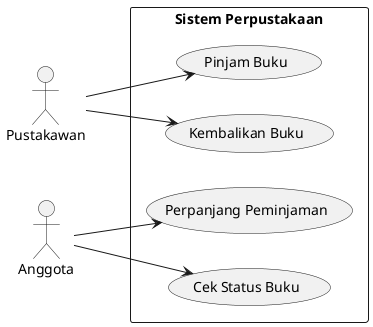
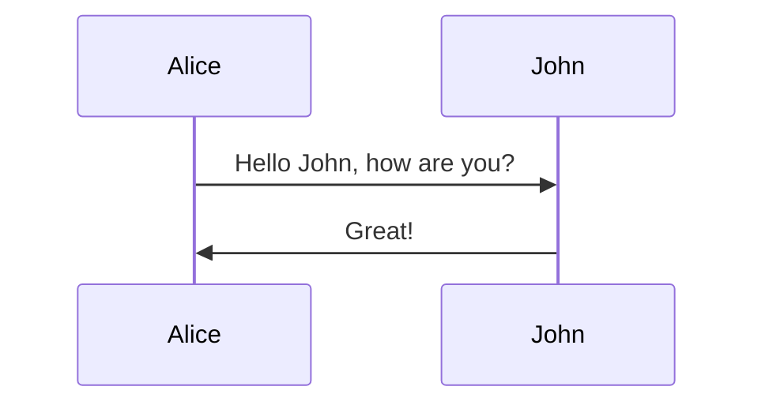
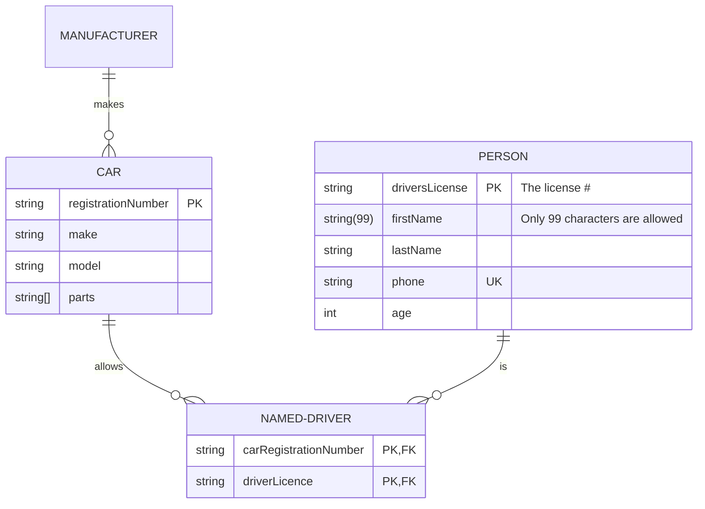

# Title

Bagian ini tulislah satu kalimat saja yang menggambarkan keseluruhan project untuk membantu orang memahami apa tujuan dan sasaran utama project tersebut.

## Badge

Tambahkan badge di bawah title. Badge yang harus ditambahkan diantaranya adalah:
1. Build Status: Menunjukkan status dari sistem otomatisasi build
2. Code Coverage: Menunjukkan cakupan coverage unit test
3. Version: Menunjukkan versi terbaru dari project
4. Pull Requests: Menunjukkan banyaknya pull request yang terbuka

   

## Description

Deskripsi adalah bagian yang memberikan gambaran umum tentang proyek yang sedang dikembangkan. Tujuannya adalah untuk menjelaskan apa tujuan proyek, apa masalah yang dipecahkan oleh proyek, dan mengapa proyek ini penting atau berguna.

Ini adalah bagian penting dari suatu proyek, dan banyak pengembang dan non-pengembang akan melihatnya. Sangat penting untuk memiliki informasi yang paling akurat dan benar. Deskripsi perlu ditulis dengan baik tanpa kesalahan tata bahasa dan dapat dibaca oleh pengguna dari berbagai latar belakang. Deskripsi tidak perlu panjang tetapi perlu merangkum keseluruhan proyek. Misalnya, apa yang dilakukan pada aplikasi ini? Teknologi apa saja yang gunakan? dan lain lain.

## Change Log

### [Versi Terbaru] - Tanggal Rilis Terbaru

### Tambah
- Fitur baru yang ditambahkan.
- Fitur baru kedua yang ditambahkan.

### Perbaikan
- Perbaikan bug yang memengaruhi penggunaan proyek.

### Menghapus
- Fitur A telah dihapus dan tidak lagi tersedia pada versi berikutnya.

### Pembaruan
- Pembaruan dokumen atau penjelasan yang ada.

## High Level Design


## Low Level Design

### Architectural Diagrams


### API details


### Database design


### Technical specifications


## Diagram

### Usecase


### Sequence



### ERD



## Swagger Link

Masukkan swagger link disini

## How To Build 

Tambahkan build di dalam Makefile untuk build project. seperti:
```bash
make build
```

## How To Run

Tambahkan run di dalam Makefile untuk menjalankan project. seperti:

```bash
make run
```

## How To Test

Tambahkan test dan test-coverage di dalam Makefile untuk menjalankan unit test project. seperti:

```bash
make test
```
```bash
make test-coverage
```